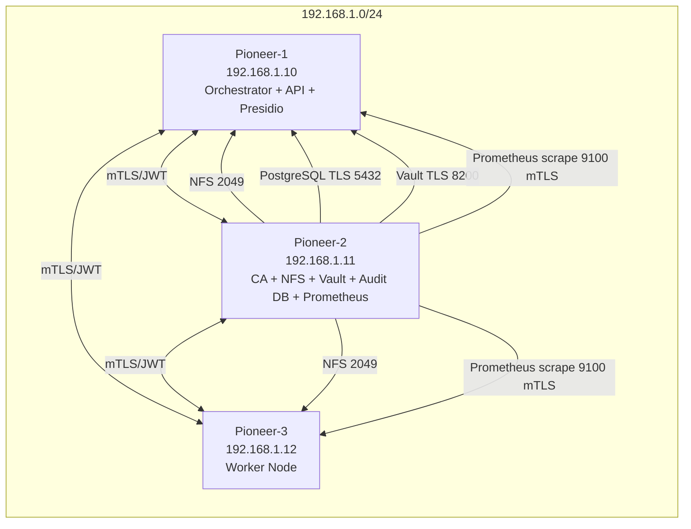

# Pioneer Cluster Security Reinstatement

## Topology

## Security Endpoints and Ports

- `22/tcp`: SSH key-only (`aiops`) from `192.168.1.0/24`
- `8443/tcp`: FastAPI over mTLS + JWT from `192.168.1.0/24`
- `2049/tcp`: NFS from `192.168.1.0/24`
- `5432/tcp`: PostgreSQL audit DB over TLS from `192.168.1.0/24`
- `8200/tcp`: Vault API over TLS from `192.168.1.0/24`
- `9100/tcp`: Node exporter HTTPS with client cert validation

## Certificate and Secret Locations

- mTLS runtime certs: `/etc/pioneer/ssl`
- Internal CA and issued certs (Pioneer-2): `/etc/pioneer/pki`
- Shared JWT secret: `/etc/pioneer/jwt_secret`
- Authz policy file: `/etc/pioneer/authz_policy.yml`
- Vault config: `/etc/vault.d/vault.hcl`
- Vault storage: `/var/lib/vault`

## API Security Model

- Access tokens are HMAC (`HS256`) and validated in `api/auth.py`.
- Global API auth enforcement is enabled by default (`EGREGORE_ENFORCE_GLOBAL_AUTH=1`).
  - Public allowlist is restricted to `/auth/token`, docs endpoints, and OpenAPI docs assets.
  - Dev compatibility mode for control center read views:
    - `EGREGORE_ALLOW_LOCAL_ANON_READONLY=1` (default in dev/test)
    - Allows unauthenticated **GET-only** access from loopback clients to dashboard read routes.
    - Disabled behind reverse-proxy forwarded traffic (`X-Forwarded-For` present).
- Claims used:
  - `sub` or `node_id`
  - `scope` (for endpoint scopes like `status`, `inference`)
  - `roles` (for write-role gating)
  - `iss`, `aud`, `nbf`, `iat`, `exp`, `jti` (required in verification path)
- Policy-as-code authorization:
  - Policy file: `/etc/pioneer/authz_policy.yml`
  - Baseline source in repository: `configs/security/authz_policy.yml`
  - Runtime mode via `EGREGORE_AUTHZ_POLICY_MODE` (`enforce`, `audit`, `disabled`)
  - Baseline rules:
    - `POST /register|/telemetry|/federation/sync` -> require `inference` scope
    - `GET /*` -> require `status` or `read` scope
    - `POST|PUT|PATCH|DELETE /*` -> require `write` or `admin` role
- Token issuing endpoint (`/auth/token`) is disabled by default.
  - Enable only with `EGREGORE_ENABLE_TOKEN_ISSUER=1`.
  - Require `EGREGORE_BOOTSTRAP_TOKEN` and `X-Bootstrap-Token` match.
  - Restrict callers via `EGREGORE_TOKEN_ISSUER_ALLOWED_CIDR`.
  - Enforce scope/role allowlists and max expiry window via:
    - `EGREGORE_TOKEN_ISSUER_ALLOWED_SCOPES`
    - `EGREGORE_TOKEN_ISSUER_ALLOWED_ROLES`
    - `EGREGORE_TOKEN_MAX_EXPIRES_HOURS`
- Auth events emit to security lane (`lane=security`) for dual-lane observability.

## PII Redaction Path

- Service client: `core/pii_redaction.py`
- Orchestrator hook: `core/orchestrator.py::security_hardening`
- Runtime endpoints:
  - Analyzer: `http://127.0.0.1:5001/analyze`
  - Anonymizer: `http://127.0.0.1:5002/anonymize`
- Fail-closed mode (`PIONEER_PII_FAIL_CLOSED=1` by default) redacts full text when services are unavailable.
- Optional fallback mode can redact email/SSN/phone patterns if fail-closed is disabled.

## Ops Copilot AI Interface (Pioneer-2 Training Window)

- Serving runtime (Pioneer-1):
  - Local Ollama endpoint on `127.0.0.1:11434`
  - API query endpoint: `POST /ai/interface/query` (requires `inference` scope)
  - Health endpoint: `GET /ai/interface/health`
- Training + RAG (Pioneer-2):
  - Curated dataset path: `/mnt/pioneer_cluster/data/training/curated_dataset.json`
  - Retrieval index path: `/mnt/pioneer_cluster/data/rag/index.json`
  - Checkpoints path: `/mnt/pioneer_cluster/models/checkpoints`
  - Serving promotion path: `/mnt/pioneer_cluster/models/ops-copilot/serving/current`
- Governance controls:
  - Strict allowlisted ingestion fields only
  - PII redaction required before writing training artifacts
  - Fail-closed policy for unresolved PII detection
  - Ledger events emitted for ingestion/training/promotion/query lifecycle

## Immutable Audit Log

- Database: `pioneer_audit`
- Table: `audit_log`
- Hash chain fields: `previous_hash`, `current_hash`
- Trigger function: `hash_audit_entry()`

## Vault Access Policies (Recommended)

Define at least:

- `pioneer-app`: read-only access to `secret/data/pioneer/*`
- `pioneer-audit`: write access to audit secret paths only
- `pioneer-ops`: break-glass administrative policy with MFA guardrails

## Backup and Restore

- Vault:
  - Backup `/var/lib/vault` snapshots on controlled cadence.
  - Store unseal keys in a separate encrypted vault solution.
- PostgreSQL:
  - Run logical backup of `pioneer_audit` and verify restore integrity.
  - Validate hash-chain continuity post-restore.
- Certificates:
  - Backup CA private key in offline encrypted storage.

## Incident Response Runbook (Baseline)

1. Detect and classify event severity.
2. Isolate impacted node at firewall and service layers.
3. Rotate JWT secret and invalidate active tokens.
4. Reissue node certificates from internal CA and redeploy mTLS assets.
5. Export audit logs and verify hash-chain continuity.
6. Rotate Vault tokens and review policy scope.
7. Complete post-incident review and update playbooks.
