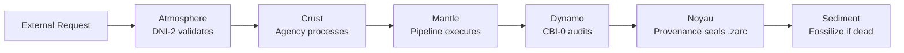

# 01 — Geological Architecture Model

> *"Le Noyau Insondable" — The core is unknowable, and that is its strength.*

Egregore organizes code into geological layers. Each layer has a specific responsibility, a concrete package path, and strict rules about what it may import.

## Layer map

| Layer | French name | Package path | Responsibility | Metaphor |
|---|---|---|---|---|
| **Noyau** | Inner Core | `src/egregore/kernel/` | Cryptographic identity, `.zarc` format, canonical hashing | Solid iron core; generates the magnetic field |
| **Dynamo** | Outer Core | `src/egregore/governance/` | CBI-0 checkpoints, audit emission, composition guards | Liquid convection; protective magnetic field |
| **Mantle** | Mantle | `src/egregore/domain/ops/`, `src/egregore/infrastructure/ops/` | JIT, energy governance, chaos, backpressure | Viscous rock; transfers heat, hidden from surface |
| **Crust** | Crust | `src/egregore/application/`, `src/egregore/domain/agency_taxonomy.py` | Agencies, species, biomes, orchestrators | Rigid plates; where all life exists |
| **Atmosphere** | Atmosphere | `src/egregore/interface/`, `src/egregore/infrastructure/`, `src/egregore/interface/dni_2_quarantine.py` | Ingress/egress filtering, quarantine, energy mediation | Protective gas layer; rejects radiation and meteors |
| **Sédiment** | Sediment | `src/egregore/shared/`, `src/egregore/infrastructure/sediment_archive.py` | Fossil registers, stratified archives, immutable history | Rock layers; geological memory |
| **Mycélium** | Mycelium | `src/egregore/interface/mycelial_network.py` | Inter-species messaging, charge transfer, TTL decay | Fungal network connecting forest trees |

## Two-plane separation

The most important rule in Egregore is the split between **Plane 1 (authoritative core)** and **Plane 2 (projection / IO)**.

### Plane 1 — Authoritative

- `kernel/`
- `domain/`
- `application/`
- `governance/`

Properties:

- Deterministic.
- Immutable history.
- Never imports Plane 2.
- Source of truth for all business logic and audit events.

### Plane 2 — Projection

- `interface/`
- `infrastructure/`
- `http_api/`
- `bus/`
- `cortex/`
- `dt1/`
- `powertrain/`

Properties:

- Observable, adaptive, replaceable.
- Reads Plane 1; never mutates it except through declared ports.
- Adapters here implement the ports defined in `interface/`.

The boundary is enforced by AST tests in `tests/test_architecture_policy_intent.py` and `tests/test_arch_enforcement.py`.

### Why two planes?

Because it makes the system **forensically simple**: anything that can change the truth lives in Plane 1 and is fully deterministic and audited. Anything in Plane 2 is a disposable view or a side effect. If a database corrupts, an HTTP handler crashes, or an LLM adapter drifts, the `.zarc` chain remains the authoritative record and the system can replay from it.

## Communication rules

1. **Mycelial only**: Species communicate via `MycelialNetwork`, never directly. *(Currently stub-level.)*
2. **No core access**: No species, biome, or lobe may import from `kernel/`.
3. **Mantle is opaque**: Species can inject work into pipelines but cannot inspect buffer internals.
4. **Atmosphere is sovereign**: DNI-2 quarantine can reject any ingress/egress without explanation.
5. **Sediment is immutable**: Fossils cannot be modified, only queried.

## Allowed cross-layer dependencies

The architecture tests enforce an explicit allowlist:

| Layer | Allowed internal dependencies |
|---|---|
| `application` | `domain`, `http_api`, `interface`, `kernel`, `models`, `powertrain`, `shared` |
| `bus` | *(none)* |
| `cortex` | `shared` |
| `domain` | `interface`, `shared` |
| `dt1` | *(none)* |
| `governance` | `shared` |
| `infrastructure` | `domain`, `interface`, `kernel` |
| `interface` | `domain` |
| `http_api` | `application`, `domain`, `models` |
| `kernel` | `shared` |
| `models` | `shared` |
| `powertrain` | `application`, `domain`, `infrastructure`, `kernel` |
| `shared` | `domain` |

See `tests/test_arch_enforcement.py` (`ALLOWED_LAYER_DEPENDENCIES`) and `tests/test_architecture_policy_intent.py` (`ALLOWED_CROSS_LAYER`).

## Energy flow



This flow is conceptual. The actual code path for a dossier generation is described in [09 — Data Flows](09_data_flows.md).

## Agency taxonomy

The crust is populated by **agencies**. Each agency has a **species**, a **biome**, and a **lobe**.

| Species | Biome | Function | Example agencies |
|---|---|---|---|
| `ACADEMIC` | `RESEARCH` | Theory, models, formal proofs | Model validation, theorem proving |
| `DEFENSIVE` | `FORTRESS` | Boundary maintenance, threat response | Firewall, intrusion detection |
| `INTELLIGENCE` | `WILDERNESS` | Reconnaissance, surveillance, tracking | Log analysis, anomaly detection |
| `PRODUCTIVE` | `FACTORY` | Value generation, work execution | Inference engines, data processing |
| `USELESS` | `GARDEN` | Aesthetic, philosophical, experimental | Art generation, random exploration |

**Lobes** are functional divisions within a species:

- `COGNITION`
- `MEMORY`
- `PERCEPTION`
- `ACTION`
- `METABOLISM`

Source: `src/egregore/domain/agency_taxonomy.py`.

## Agency lifecycle

```
Birth  (agency registered on crust)
   |
   v
Live   (processes work units, consumes energy)
   |
   v
Die    (energy depleted, mission complete, or killed by chaos)
   |
   v
Fossilize  (becomes sediment in stratum)
   |
   v
Retrieval  (future species study the fossil)
```

`CrustPopulation` manages the registry; `SedimentArchive` stores fossils. See [06 — Infrastructure Adapters](06_infrastructure_adapters.md).

## Current gaps

- **Mantle / ops layer**: documented but largely missing. `domain/ops/` and `infrastructure/ops/` do not exist yet.
- **Mycelial network**: exists as `src/egregore/interface/mycelial_network.py` but is a stub.
- **DNI-2 quarantine**: exists but has broken imports (`domain.work_unit`, `interface.ops.ops_ports` are missing).

See [11 — Repository State](11_repository_state.md) for details.
