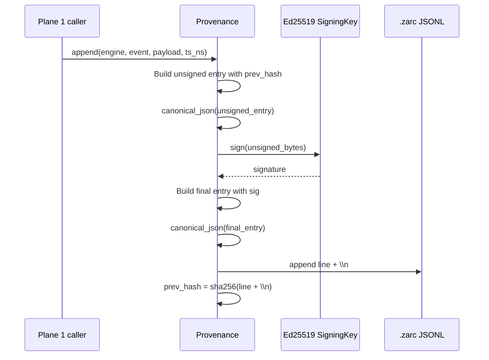

# 02 — Zarc Provenance

Status: `implemented & tested`

## What `.zarc` is

`.zarc` is Egregore's append-only, signed, hash-chained JSONL audit log. Each line is a self-describing record that commits:

- `ts_ns` — timestamp in nanoseconds (injected, never wall-clock in core)
- `engine` — logical source of the event
- `event` — event name
- `payload` — arbitrary structured data
- `prev_hash` — SHA256 of the previous canonical line
- `sig` — Ed25519 signature over the unsigned canonical record

Source: `src/egregore/kernel/provenance.py`.

## Why `.zarc` exists

It is the **single system of record**. Every meaningful state change ends up in `.zarc`. Because the chain is signed and hash-linked, you can:

1. Detect tampering (`verify_chain()`).
2. Replay state from scratch.
3. Prove determinism by comparing two `.zarc` files bit-for-bit.
4. Bridge to external forensic formats (e.g., dfih `ExecutionTrace`).

## Canonical JSON contract

Hashing and signing depend on deterministic serialization. The canonicalizer lives in `src/egregore/shared/canonical.py`.

Rules:

- UTF-8 safe (`ensure_ascii=False`).
- Keys sorted recursively (`sort_keys=True`).
- No whitespace (`separators=(",", ":")`).
- NaN/Inf rejected fail-closed.

Only `shared/canonical.py` may define `canonical_json`, `canonical_dumps`, `canonical_loads`, and `sha256_hex`. This is enforced by `tests/test_arch_enforcement.py`.

## Entry lifecycle



## Key types

| Type / Function | File | Purpose |
|---|---|---|
| `ZarcEntry` | `kernel/provenance.py` | Immutable parsed record. |
| `Provenance` | `kernel/provenance.py` | Writer/reader/verifier for a `.zarc` file. |
| `canonical_json` / `sha256_hex` | `shared/canonical.py` | Deterministic serialization & hashing. |
| `stable_event_id_from_envelope_components` | `shared/stable_ids.py` | Replay-stable event/outbox identity derivation. |
| `ProvenanceEvent` | `domain/provenance_model.py` | Domain-level event contract (no prev_hash/sig). |
| `IProvenanceSink` / `IProvenanceVerifier` | `interface/provenance_port.py` | Ports for Plane 2 adapters. |
| `ZarcProvenanceSink` | `infrastructure/zarc_provenance_sink.py` | Adapter from domain event to kernel writer. |
| `ZarcJournal` | `infrastructure/zarc_journal.py` | Atomic T2 commit journal backed by `.zarc`. |
| `ICommitJournal` | `interface/zarc_journal_ports.py` | Read-side port for replayed snapshots/events/outbox. |

## Verification

`Provenance.verify_chain()` checks every line:

1. Signature is valid (`verify_key.verify(unsigned_bytes, sig_bytes)`).
2. `prev_hash` matches the SHA256 of the previous canonical line.
3. First `prev_hash` is `0...0` (64 zeros).

`verify_line()` checks only the signature of a single line.

## Hash chain details

- Initial `prev_hash`: `"0" * 64`.
- After appending line `L`, the next `prev_hash` becomes `sha256((L + "\n").encode("utf-8"))`.
- The `sig` field is **not** part of the unsigned record; it is appended after signing.

## Bridges

### dfih bridge

`src/egregore/kernel/dfih_bridge.py` converts `.zarc` lines into `ExecutionTrace` records for external deterministic fault-injection/harness tools.

It maps:

- `event` → `stage.name`
- `payload.reason` → `FaultInjection` (active if present)
- `payload.wu_id` / `scenario_id` / `prev_hash` → `scenario_id`
- All other fields → `metadata`

It does **not** verify signatures; verification is the caller's responsibility.

### External ledger bridge

`src/egregore/kernel/external_ledger_to_zarc.py` imports an external hash-chained JSONL ledger and re-commits it as a signed `.zarc`.

Steps:

1. Verify the external ledger's own hash chain (`prev_hash` + `hash`).
2. Convert ISO8601 timestamps to epoch nanoseconds.
3. Append each external entry as a `.zarc` record with engine `"external_ledger"`.
4. Return whether the resulting `.zarc` chain verifies.

This is the migration path for external deterministic ledgers into Egregore's native provenance format.

## ZarcJournal: the atomic commit journal

`src/egregore/infrastructure/zarc_journal.py` implements the persistence ports required by the semantic executor.

Implements:

- `ITransactionalPersistence` — `commit_generate_t2(...)`
- `IIdempotencyStore` — success-result cache
- `ICaseStore` — case state / next version
- `ICommitJournal` — replayed snapshots, events, outbox entries

### Fail-closed determinism

```python
now_ns=lambda: (_ for _ in ()).throw(
    RuntimeError("ZarcJournal requires deterministic ts_ns injection")
)
```

The journal refuses to invent wall-clock timestamps. `timestamp_ns` must be supplied by Plane 1.

### Persistence payload

A `commit_generate_t2` entry contains:

- `execution_id` (idempotency fingerprint)
- `command` (organization_id, case_id, engine_version, policy_version, etc.)
- `version` (version_id, version_number, case_next_state, next_version)
- `snapshot_data` (computed_data)
- `events` (AuditEvent list)
- `outbox_entries` (OutboxEntry list)
- `usage_deltas`

### Replay

On construction, `ZarcJournal` reads every `.zarc` entry and rebuilds:

- `_success_by_fingerprint`
- `_case_view_by_key`
- `_snapshot_by_execution_id`
- `_events_by_execution_id`
- `_outbox_by_execution_id`
- `_terminal_fingerprints`

This makes the journal **event-sourced**: the file is the database.

## Invariants

| Invariant | Enforcement |
|---|---|
| Canonical JSON is deterministic | `shared/canonical.py` rejects NaN/Inf, sorts keys, strips whitespace. |
| Signatures are Ed25519 | `nacl.signing.SigningKey` / `VerifyKey`. |
| Hash chain is continuous | `Provenance.verify_chain()` checks `prev_hash`. |
| Wall-clock cannot enter Plane 1 | `ZarcJournal.now_ns` raises `RuntimeError`. |
| `json.loads`/`json.dumps` only in canonical | `tests/test_architecture_policy_intent.py`. |

## Known issues

- `canonical_loads()` currently delegates to `json.loads`. This is the only permitted call site, so decoding is not canonicalized (only encoding is). This is intentional: whitespace-insensitive parsing is acceptable for verification; signatures are produced by `canonical_dumps`.

## Tests

- `tests/test_external_ledger_to_zarc.py`
- `tests/test_architecture_policy_intent.py` (canonicalization single-source)
- `tests/test_arch_enforcement.py` (canonicalization single-source)
- `tests/test_semantics_backbone.py`
- `tests/test_semantics_backbone_replay.py`
