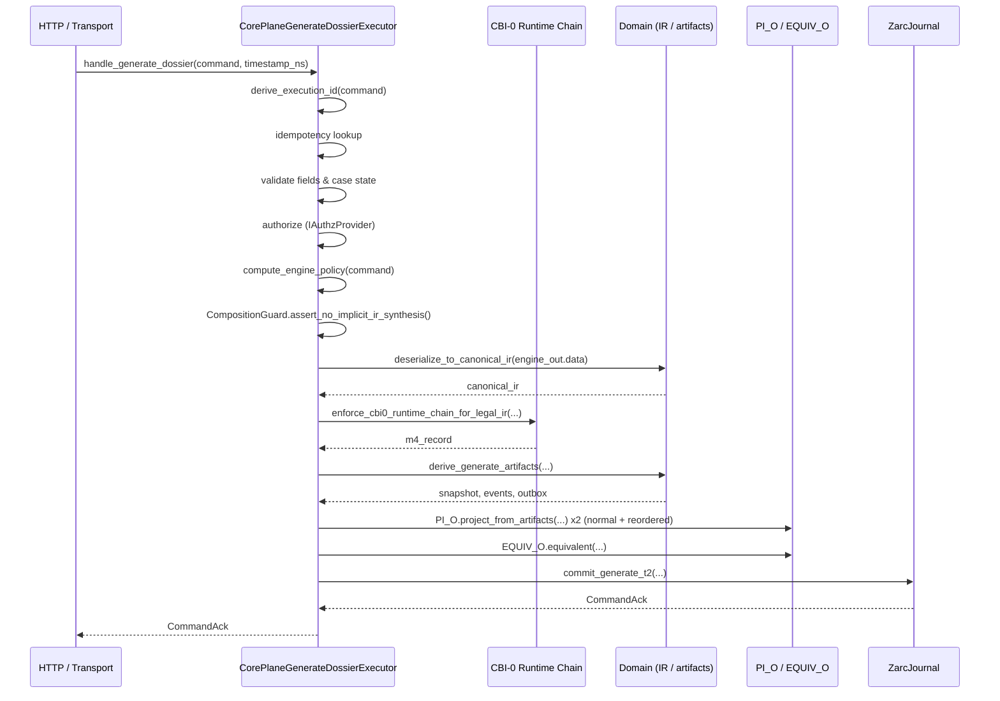

# 04 — Application Runtime

Status: `implemented & tested`

The application layer orchestrates deterministic computation, governance, and durable commit. It sits above the domain layer and below the HTTP/transport layer.

## Core command executor

Source: `src/egregore/application/semantics_executor.py`.

`CorePlaneGenerateDossierExecutor` is the primary command executor for dossier generation. It is deterministic, fail-closed, and idempotent.

### Flow

### Key responsibilities

1. **Idempotency** — `derive_execution_id()` hashes a version-aware identity lattice (`organization_id`, `case_id`, `input_fingerprint`, `engine_version`, `policy_version`, `causality_id`).
2. **AuthZ** — `IAuthzProvider.authorize_generate()` is called before any durable mutation.
3. **State transition validation** — `CaseState` transitions are checked against `_ALLOWED_TRANSITIONS`.
4. **Execution path validation** — the path must start at `INIT` and end at `COMMIT`.
5. **Deterministic compute** — `compute_engine_policy` is injected; it must be pure.
6. **CBI-0 governance** — `enforce_cbi0_runtime_chain_for_legal_ir()` runs M2/M1/M4.
7. **Canonical IR boundary** — engine output is deserialized to `CanonicalSemanticIR`.
8. **Artifact derivation** — only `derive_generate_artifacts()` constructs audit/outbox objects.
9. **Observable envelope invariance** — two projections (normal + reordered) must be `EQUIV_O`-equivalent.
10. **Atomic T2 commit** — `ITransactionalPersistence.commit_generate_t2()` persists everything.

### Fail-closed rules

- `timestamp_ns` must be supplied; no wall-clock fallback.
- Missing required fields raise `SemanticsError` with `VALIDATION_FAILED`.
- Forbidden state transitions raise `SemanticsError` with `FORBIDDEN_STATE_TRANSITION`.
- CBI-0 failure raises `SemanticsError` with `VALIDATION_FAILED`.
- If T2 commit fails, no success ack is returned.

## CBI-0 orchestrated executor

Source: `src/egregore/application/cbi_0_orchestrated_executor.py`.

`CBI0OrchestratedExecutor` wires the full M1–M4 chain around a single legal agent.

### M1 — Projection access monitor

Source: `src/egregore/application/cbi_0_projection_access_monitor.py`.

`ProjectionAccessMonitor` validates that an agent's accessed IR fields are a subset of its declared descriptor scope. Fail-closed: raises `ProjectionBindingError` on undeclared access.

### M2 — Projection registry validator

Source: `src/egregore/application/cbi_0_projection_registry_validator.py`.

`ProjectionRegistryValidator` validates:

- Every active agent has a registered descriptor.
- Every non-empty scope overlap has an `OverlapClassification`.
- Classification consistency: `DISJOINT` only when overlap is empty; `EQUIVALENT` requires identical scopes; `DEPENDENT` requires strict subset.

### M3 — Composition guard

Source: `src/egregore/application/cbi_0_composition_guard.py`.

`CompositionGuard` prevents terminal artifacts from re-entering the IR synthesis boundary:

- `assert_terminal(output, source_agent_id)` — records a fingerprint and rejects reuse.
- `assert_no_implicit_ir_synthesis(source_agent_id, target_input, target_type_name)` — raises `CompositionGuardError` if a known terminal output (e.g., `LegalAnalysisOutput`) is routed toward `CanonicalSemanticIR` construction without an explicit bridge.

### M4 — Binding audit emitter

Source: `src/egregore/application/cbi_0_binding_audit_emitter.py`.

`MemoryBindingAuditEmitter` performs an equivalence sweep:

- Computes `registry_hash` from descriptor canonical hashes.
- Computes `runtime_state_hash` from a runtime representation.
- Compares runtime access surface against declared projection scopes.
- Emits a `BindingAuditRecord` with `equivalence_status` `EQUIVALENT` or `DIVERGED`.

### Runtime chain helper

`enforce_cbi0_runtime_chain_for_legal_ir(...)` runs M2 → M1 → M4 for the live path. M3 is enforced separately when a terminal agent output exists.

## Legal reasoning engine

Source: `src/egregore/application/legal_reasoning_engine.py`.

`LegalReasoningEngine` is a pure, deterministic 4-stage pipeline:

1. `_bind_facts(ir)` — project IR statements to `LegalFact` primitives.
2. `_map_rules(facts)` — find applicable rules via `IRuleRegistry`.
3. `_build_inference_graph(rules, facts)` — construct inference nodes with confidence propagation and uncertainty detection.
4. `_compose_output(...)` — synthesize `LegalAnalysisOutput`.

Before running, `analyze()` calls `ExecutionAuthority.assert_governed()`. Ungoverned execution raises `RuntimeError`.

Output properties:

- `prohibited_conclusions` is always `()`.
- Conclusions are evidence-bounded (e.g., "Rule X may apply").
- Confidence values are in `[0.0, 1.0]`.

## Constrained semantic engine

Source: `src/egregore/application/constrained_semantic_engine.py`.

`ConstrainedSemanticEngine` performs deterministic semantic collapse:

- Normalizes candidates.
- Drops candidates containing forbidden legal phrasing.
- Selects the lexicographically first admissible candidate.
- If nothing survives:
  - `strict` mode raises.
  - `safe_fallback` mode returns a deterministic evidence-bounded fallback.

This is a layer-0 admission gate: unsafe language never reaches downstream reasoning.

## Replay interpreter

Source: `src/egregore/application/semantics_replay_interpreter.py`.

`CorePlaneReplayInterpreter` is the reference replay correctness anchor. Given the original command and persisted artifacts, it:

1. Recomputes engine output.
2. Re-deserializes to canonical IR using the pinned `reasoning_version_id` from the snapshot.
3. Re-runs the CBI-0 chain.
4. Validates event and outbox identities against canonical event envelope components.
5. Compares committed vs replayed observable envelopes using `PI_O` and `EQUIV_O`.
6. Runs evaluator-spoofing tolerance checks.

Result: `ReplayEquivalenceResult(ok, failures, governance_trace)`.

## Policy versioning

Source: `src/egregore/application/policy_versioning.py`.

`VersionedPolicyExecutor` pins policy execution to exact versions:

- `IPolicyVersionRegistry.lookup(policy_version)` returns deterministic `IPolicyLogic`.
- `execute()` validates the command, computes the policy result, and records metadata.
- `InMemoryPolicyVersionRegistry` is the Phase 0 in-memory implementation.

Invariants:

- Policy version must be explicit; no auto-detection.
- Committed policy versions are immutable for replay.
- `version_id` derivation includes `engine_version` and `policy_version`.

## Consistency and causality

Source: `src/egregore/application/consistency_and_causality.py`.

`ConsistencyAndCausalityEnforcer` ensures:

- Monotonic version numbering per `(organization_id, case_id)`.
- `causality_id` present in every event.
- `version_id` matches causality context.

`CausalityReconstructor` rebuilds causal chains from event sequences for replay verification.

## Replay determinism

Source: `src/egregore/application/replay_determinism.py`.

`ReplayDeterminismValidator` records and validates:

- `engine_version`
- `policy_version`
- `reasoning_version_id`
- `input_fingerprint`
- `output_fingerprint`

All five must match for replay to be considered equivalent.

## Other application modules

| Module | Purpose |
|---|---|
| `dossier_generate_service.py` | Higher-level dossier generation service |
| `service_facades.py` / `http_v1_facades.py` | Facades for HTTP and service layers |
| `http_v1_service.py` | HTTP-specific service orchestration |
| `http_journal_provider.py` | Provides journal to HTTP layer via dynamic import (preserves two-plane rule) |
| `in_memory_dossier_adapters.py` | In-memory adapters for tests |
| `document_intake.py` | Document ingestion |
| `local_vertical_inference.py` | Local inference routing |
| `turbine_unit_runner.py` | Turbine execution runner |
| `gearbox_evaluate_policy_adapter.py` | Gearbox policy adapter |
| `thermal_governor_service.py` | Thermal governor service wrapper |
| `ws_chat_transport_mapper.py` | WebSocket chat transport mapping |
| `orchestrator/orchestrator_sequencer.py` | Orchestrator sequencing |
| `rbac_authz_provider.py` | RBAC authorization provider |
| `mappers/execution_envelope_mapper.py` | Deterministic envelope → `DossierGenerateRequest` mapping |

## Invariants

| Invariant | Enforcement |
|---|---|
| No wall-clock in core | Executor rejects `timestamp_ns=None`. |
| Idempotency version-aware | `derive_execution_id` includes engine/policy versions. |
| CBI-0 non-bypassable | `enforce_cbi0_runtime_chain_for_legal_ir` called in live + replay paths. |
| Audit artifacts single-sourced | `derive_generate_artifacts()` only. |
| Legal agent governed | `ExecutionAuthority.governed()` wrapper in `CBI0OrchestratedExecutor.run_legal_agent_v1()`. |
| Application may not import infrastructure | `tests/test_arch_enforcement.py`. |

## Tests

- `tests/test_semantics_executor_observability_guard.py`
- `tests/test_semantics_backbone.py`
- `tests/test_semantics_backbone_replay.py`
- `tests/test_gate5_invariants.py`
- `tests/test_cbi_0_runtime_chain.py`
- `tests/test_cbi_0_enforcement.py`
- `tests/test_legal_agent_pipeline.py`
- `tests/test_phase2_policy_versioning.py`
- `tests/test_phase3_consistency_causality.py`
- `tests/test_ritual_engine_replay.py`
