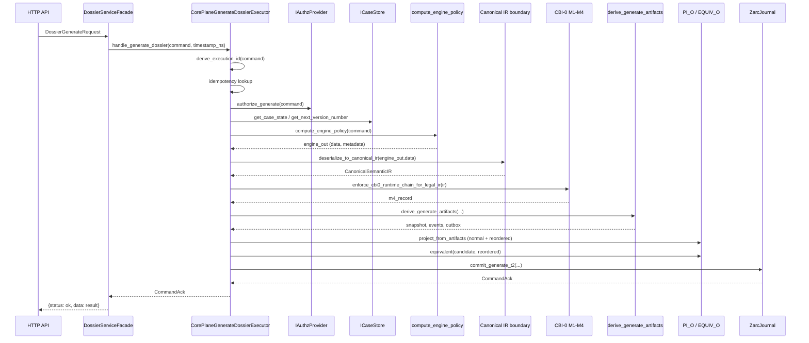
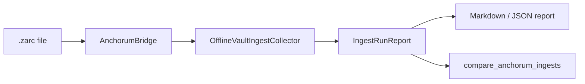
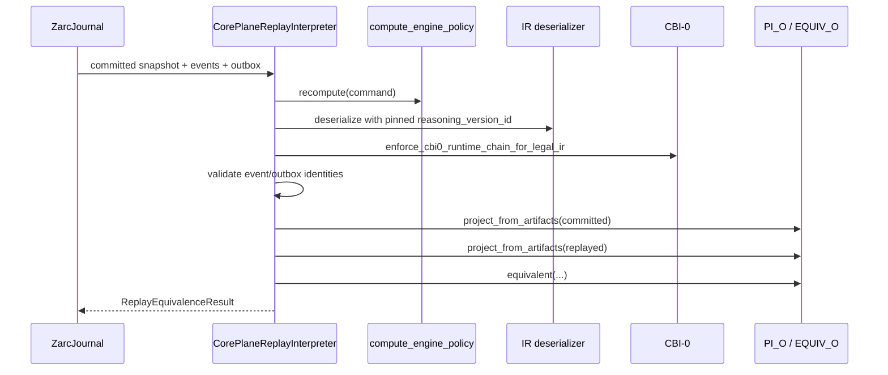
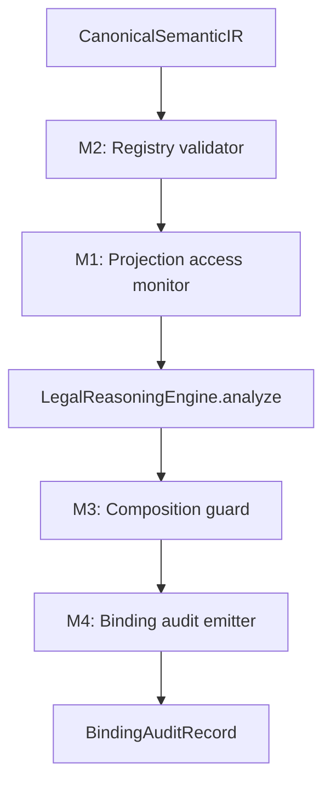
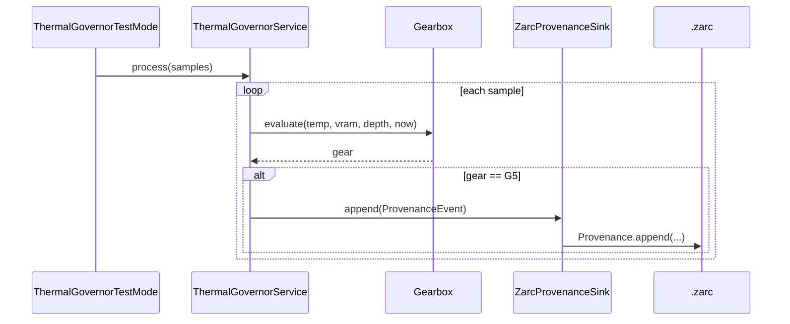
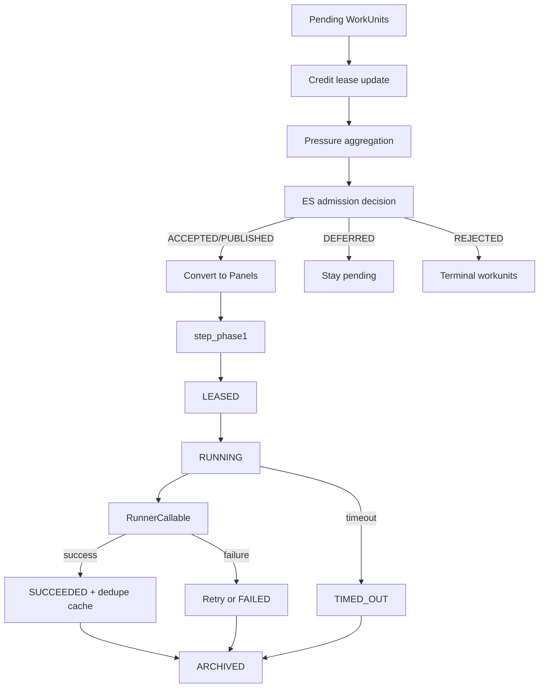
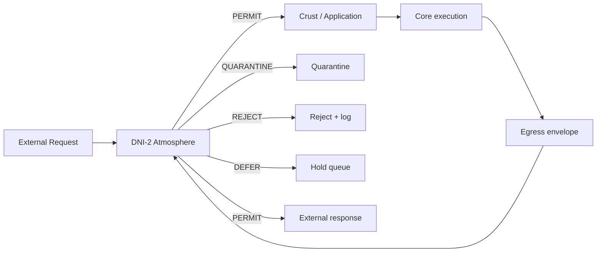

# 09 — Data Flows

This document traces end-to-end flows through Egregore with Mermaid diagrams.

## Flow 1: Dossier generation (happy path)

### Durable artifacts produced

- One `.zarc` entry (`engine="egregore_journal"`, `event="commit_generate_t2"`) containing:
  - command identity
  - version metadata
  - snapshot data
  - audit events
  - outbox entries
  - usage deltas
- In-memory read models updated deterministically.

## Flow 2: ANCHORUM offline ingest

1. `run_anchorum_bridge_ingest()` reads the last `N` `.zarc` entries.
2. `AnchorumBridge` packages each entry as a `VaultIngestRecord`.
3. `OfflineVaultIngestCollector` captures the batch in-memory.
4. An `IngestRunReport` is written to `--outdir`.
5. Two reports can be compared with `compare_anchorum_ingests()`.

Note: the governance-layer runner does **not** verify the `.zarc` chain because it must not import `kernel/`.

## Flow 3: Replay verification

Replay proves that the committed artifacts are reproducible from the original command plus the pinned versions.

## Flow 4: CBI-0 governance checkpoint

- M2 ensures descriptors and overlap classifications are complete/consistent.
- M1 ensures accessed IR fields are within declared scope.
- Legal reasoning runs only inside `ExecutionAuthority.governed()`.
- M3 blocks terminal output from re-entering canonical IR without a bridge.
- M4 emits a spec/runtime equivalence record.

## Flow 5: Thermal governor event path

Only G5 transitions are durably logged. The service uses the `IProvenanceSink` port, so the provenance backend can be swapped.

## Flow 6: DT1 panelmesh scheduling

The orchestrator is fully deterministic: all nondeterminism is pushed into the injected `RunnerCallable`.

## Flow 7: Ingress / egress (intended, not currently functional)

Note: `interface/dni_2_quarantine.py` currently has broken imports and cannot be imported. The design intent is documented here.

## Cross-cutting concerns

| Concern | Where enforced |
|---|---|
| Wall-clock exclusion | Executor, ZarcJournal, SQLite persistence, telemetry collector, panelmesh ticks |
| Canonical JSON | `shared/canonical.py` |
| Ed25519 signatures | `kernel/provenance.py`, `governance/dag_signer.py` |
| Deterministic identity | `derive_execution_id`, `stable_event_id_from_components` |
| Idempotency | `IIdempotencyStore`, replay-safe `.zarc` writes |
| Audit artifact single-sourcing | `domain/semantics/derivations.py` |
| Governance non-bypassability | `CBI0OrchestratedExecutor`, `ExecutionAuthority` |
